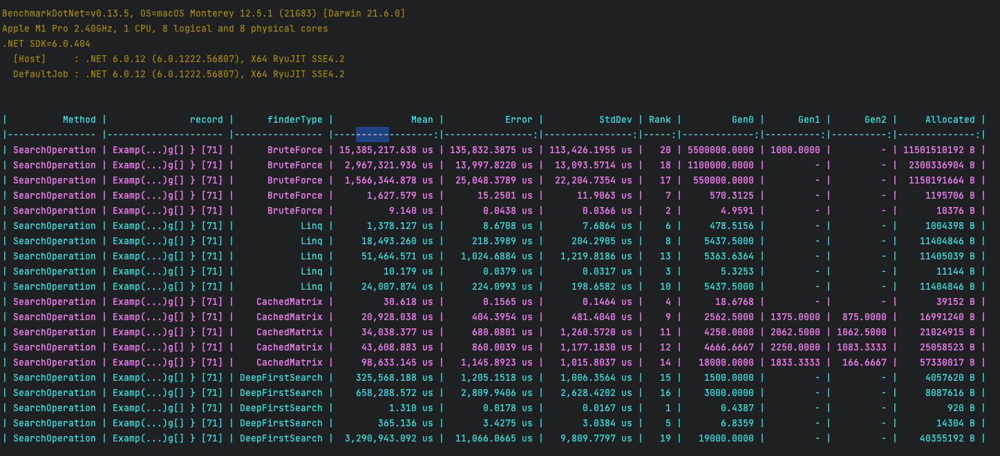

# Developer Challenge: Word Finder

I found this challenge very interesting and for that reason I tried to complete it using different approaches to compare the performance and check the optimal solution.

### 1st: Using Linq to Search in Rows and Columns of the Matrix
Class: LinqWordFinder

I used this approach as the easy way, but not expecting to be the best since some operations could be more expensive using the memory since first need to get all the lines vertical/horizontal, them execute some search, make the count the number of words that are found
and sorting in descending way to get the top 10. However, this could be good approach when the wordstreem is a short list.


### 2nd: Store the Matrix as a Dictionary of Keywords
Class: CachedWordFinder

The idea here is that for each line(rows/columns) create small chunks of possible words and how may times is repeated in the matrix, then store in a dictionary,
that will allow to search each word by key. This approach is initially expensive since need to store all possible values,
but could be better executing the search when handling large wordstream.


### 3rd: Using DFS Algorithm to Search the First Letter and Then the Full Word Match
Class: DFSWordFinder

Using Deep First Search approach iterate each row and column looking for the firs letter of the word that is searched and when is found
continue checking the row and column until get a full match.
This approach seems to be good for small wordstream but maybe no the best for large stream.


### 4th: Brute Force Search(Just for comparison purposes)
Class: BruteForceWordFinder

Brute force is the simplest way to test iterating over each row and column. I check this approach to validate the difference
in the performance.

NOTE: Included to test but I do not consider that could be good solution for this challenge.


## Comparation and Conclusion

In order to test I created multiple examples to check the behavior of each approach and
how it handle wordstream of different sizes, I used the nuget package BenchmarkDotNet and tested the performance using theses scenarios:

- Matrix 7x8 searching 5 words
- Matrix 40x64 searching 100 words
- Matrix 40x64 searching 100k words.
- Matrix 40x64 searching 200k words.
- Matrix 40x64 searching 1M words.

With the result I got to the conclusion that:
- Using Linq: Even do I wasn't expecting this result, using Linq was faster than the others approaches, and seems to be the best option using small and large wordstream.
- CachedDictionary: Had the second better performance almost similar than linq but not the best option for small wordstream.

- Using DFS: It's the better options for small to medium wordstream(less than 2k) but performance get worst with large wordstream.
- Bruteforce: Not an option for this challenge.

#### Benchmark Results Used for the Evaluation:




## Execute

### Show Search Results
By default is testing searching one hundred thousand words in a matrix of 40x64. 
To test with different example check the line 27 in the Program.cs.
```
dotnet restore
dotnet run
```

### Show Benchmarks Results

To show Benchmark uncomment line 9 of Program.cs, and run the following block of code in the terminal:

```
dotnet restore
dotnet run -p qu.word.finder/qu.word.finder.csproj -c Release
```

The execution can take some minutes since is testing each approach with different data.
